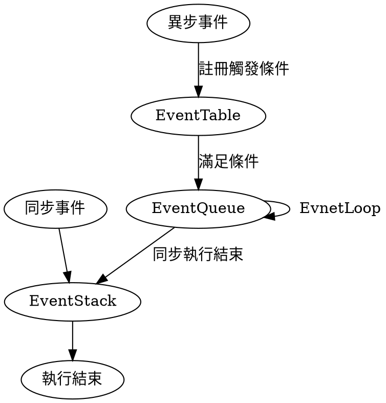

# Javascript 中的同步與非同步
###### tags: JavaScript
--- 
## 定義
同步就是程式一行行執行下去，執行完一行裡面的所有東西才會繼續執行下一步，而什麼是非同步？舉個例子來說，當你今天晚上要準備一頓大餐給女朋友一個驚喜大餐，而有規劃的你先把要準備的料理步驟與各個步驟所花費的時間整理下來。

* 紅酒燉牛肉

|時間|料理步驟
|---|---|
|10min|準備食材   |
 |30min|醃製牛肉|
|10min|炒牛肉|
|10min|炒蔬菜|
|30min|燉煮|

如果你做這道料理的方式是根據著上面的步驟，並且要等待目前步驟完成後才繼續進行下一個步驟的話，完成總共這道料理所需要的時間為 90 min 。

現在觀察一下料理的步驟可以發現醃製牛肉跟燉煮的部分是最花時間的
尤其是醃製牛肉的部分，其實什麼都不用做但就會被卡住 30 分鐘，
這就是同步的程式所會遇到的問題，如果有資料 I\O 就會導致整個程式被卡住。
那要怎麼解決這樣的問題？
如果以上面的例子來說，上面步驟的相依性為
```flow
st=>start: 醃製牛肉
op=>operation: 炒牛肉
op2=>operation: 燉煮
para=>parallel:炒蔬菜
st->op->op2
```
可以發現其實炒蔬菜並不相依於醃製牛肉的部分，如果能在醃製牛肉的時候去炒蔬菜就能多節省 10 分鐘的時間，這個時候就需要的是**非同步**。
從上面的例子來看就可以知道非同步的程式可以使時間可以相對被節省跟看起來比較有在做事（？。

## JavaScript 的非同步
:::success
在 Javascript 本身在執行時一次就只能做一件事能產生非同步的功能主要是透過瀏覽器或 NodeJS 所提供的 API 
:::
JavaScript 執行是在 單執行緒 (SingleThread) 的環境中，如果在網頁中需要有大量圖片載入那是不是就會導致其他部分因為檔案的 I/O 而無法執行，為了解決這樣的問題 JavaScript 透過呼叫瀏覽器或 NodeJS API 來達到非同步來讓程式在完成某些條件前能夠先去執行其他程式，實現這樣的功能主要是透過 **Event Loop** 的方式。
而所謂的 **Event Loop** 就是一個檢查事件有沒有達到其條件的迴圈，其在 Javascript 中的運作簡單來講就是 (更詳細的 Event Loop 介紹會在另外一篇文章)

* Event Loop 執行順序
    1. JavaScript 在執行時會先判斷是同步事件或是異步事件
    2. 如果是異步事件會先將事件註冊至 EventTable
    3. 滿足觸發條件後會將事件移至 EventQueue
    4. 等待 EventStack 中為空時，就會將 EventQueue 中的事件取出來執行
    
* 在瀏覽器中運作會如下
    1. JavaScript 在運行時間，會將執行的函式 push 至 stack 上如果其中有相關之非同步運行的 API (Example: DOM、ajax、setTimeOut)
    2. 執行 API 並把其目前函式放到 Queue 中然後依上面 EventLoop 的方式運行。


* 在 NodeJS 中的運行方式

     1. Node JS 的實作方法類似瀏覽器也是利用 API 不過 API 的對象是作業系統，並透過 LIBUV 這個由 C 寫成的非同步函式庫來達到非同步的效果 (感覺之後可以深入了解再來寫一篇)
     


* 接下來讓我們來看一些簡單的例子，來看一下非同步在 javascript 中是如何運作，這邊的例子我們是用 `setTimeout` 這個 API 

```javascript=
console.log("First");

setTimeout(() => {
   console.log("Async")
}, 10);

console.log("Third");
```
```shell=
First
Thrid
Async
```

從上面簡單的例子可以看出，最先印出了 `First` 然後是 `Third` 最後才是 `Async` 但是從程式來看，我們知道 Javascript 是直譯器常理來說應該會是`First` -> `Async` -> `Third` ，`setTimeout` 在這邊發揮它的作用，先執行印出 `Third` 等到都執行完後才去執行 `setTimeout` 中的程式。

再來看一個比較複雜的例子，在 Async 的程式中執行 `ForEach` 
```javascript=
var array = [1, 2, 3, 4]

//set the Timeout time will increase 
//to observe the queue event
function asyncForEach(array, cb) {
   array.forEach(function(i)  {
       setTimeout(cb, 1000 * i, i)
   })
}

asyncForEach(array, function(i) {
   console.log(i);
})

//Synchrous
array.forEach(function(i){
    console.log(i)
})
```
將上述的程式碼執行起來，可以發現執行的邏輯跟前述所說的非同步的邏輯依樣，先執行同步的程式碼，再根據其非同步進入 Queue 的順序採 FIFO 的方式取出執行。

## 總結
利用非同步的方式可以讓程式在某些時間避免不避要的浪費，不過並不代表其能提升程式的效能，從 Event Loop 的運作方式來看其實要做的事情比同步還要多，所以使用非同步的方式來撰寫程式前要考慮是否有其必要性。
介紹完非同步在 javascript 的底層實作邏輯後，接下來要介紹其所使用的語法糖 `Promise`、`Async Await`。


